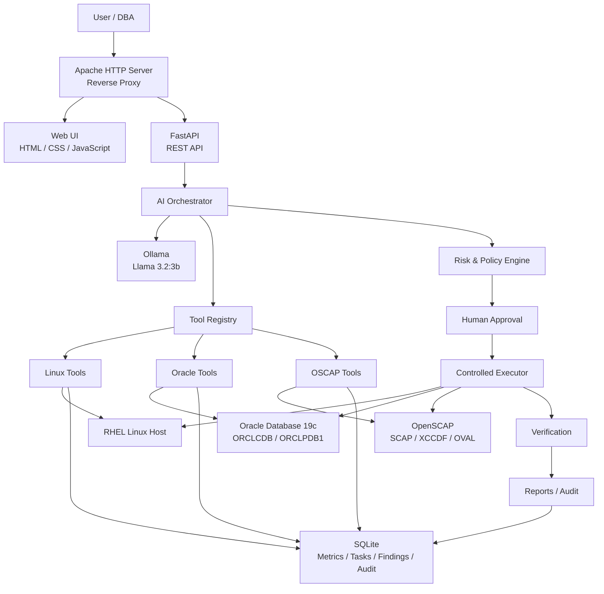

# Stage 1 — AI Linux & Oracle Foundation

## 1. Purpose

Stage 1 establishes the foundation for the local AI-powered DBA and
Linux operations platform.

The objective is to evolve the existing OS monitoring prototype into
a structured agent architecture using:

- FastAPI
- Ollama
- Llama 3.2:3b
- Python
- Linux diagnostic tools
- Oracle Database 19c
- OpenSCAP
- SQLite

The existing Flask implementation will remain temporarily during the
FastAPI migration to avoid disrupting the currently working system.

---

# 2. Stage 1 Architecture



---

# 3. Core Design Principle

The LLM is the reasoning and orchestration layer.

The LLM is NOT the privileged execution layer.

The intended flow is:

```text
User Request
     |
     v
FastAPI
     |
     v
AI Orchestrator
     |
     v
Ollama / Llama 3.2:3b
     |
     v
Tool Selection
     |
     v
Tool Registry
     |
     +-------------------+
     |                   |
     v                   v
 Linux Tools        Oracle Tools
     |                   |
     v                   v
    RHEL             Oracle 19c
```

The model should select approved tools rather than directly executing
arbitrary shell commands or arbitrary SQL.

---

# 4. Stage 1 Components

## 4.1 Web/API Layer

Target framework:

**FastAPI**

Responsibilities:

- REST API
- Request validation
- Response validation
- Authentication boundary
- API documentation
- Communication with the AI orchestrator

The current Flask implementation will be migrated incrementally.

---

## 4.2 AI Layer

Technology:

- Ollama
- Llama 3.2:3b

Responsibilities:

- Understand user intent
- Select tools
- Interpret tool results
- Correlate Linux and Oracle information
- Produce explanations
- Produce recommendations

The model does not directly receive unrestricted system privileges.

---

## 4.3 Tool Registry

The tool registry provides a controlled interface between the AI
orchestrator and system operations.

Initial tool domains:

```text
Linux
Oracle
OSCAP
```

Example tools:

```text
linux.get_cpu()
linux.get_memory()
linux.get_disk()
linux.get_services()

oracle.get_database_status()
oracle.get_instance_status()
oracle.get_pdb_status()
oracle.get_tablespace_usage()
oracle.get_active_sessions()

oscap.scan()
oscap.get_results()
```

---

# 5. Linux Tools

Initial Linux tools are read-only.

```text
linux.get_system_info()
linux.get_cpu()
linux.get_memory()
linux.get_swap()
linux.get_disk()
linux.get_processes()
linux.get_services()
linux.get_failed_services()
linux.get_network()
linux.get_listening_ports()
linux.get_logs()
linux.get_failed_logins()
linux.get_selinux_status()
linux.get_packages()
```

The existing Linux monitoring functionality will be reused where
possible rather than rewritten unnecessarily.

---

# 6. Oracle Tools

Oracle integration begins with Oracle Database 19c.

Current target environment:

```text
ORACLE_SID:
ORCLCDB

ORACLE_HOME:
/opt/oracle/product/19c/dbhome_1
```

Current database:

```text
ORCLCDB
READ WRITE
CDB = YES
```

Current PDBs:

```text
PDB$SEED
READ ONLY

ORCLPDB1
READ WRITE
```

Initial Oracle tools are read-only:

```text
oracle.get_database_status()
oracle.get_instance_status()
oracle.get_pdb_status()
oracle.get_tablespace_usage()
oracle.get_active_sessions()
```

Additional tools will be added after the initial Oracle integration works:

```text
oracle.get_blocking_sessions()
oracle.get_datafiles()
oracle.get_parameters()
oracle.get_listener_status()
oracle.get_alert_log()
```

---

# 7. Oracle Security Principle

The AI must not be given unrestricted SQL execution.

Bad architecture:

```text
LLM
 |
 +-- arbitrary SQL
 |
 v
Oracle
```

Target architecture:

```text
LLM
 |
 +-- oracle.get_tablespace_usage()
 |
 v
Python Tool
 |
 +-- predefined SQL
 |
 v
Oracle
```

This provides deterministic database operations and reduces the
risk of destructive or unintended SQL execution.

---

# 8. OSCAP

OpenSCAP remains part of the platform.

Current environment:

```text
OpenSCAP 1.3.14
SCAP 1.3
XCCDF 1.2
OVAL 5.11.1
```

The initial OSCAP workflow is:

```text
OSCAP Scan
    |
    v
Results XML
    |
    v
Parser
    |
    v
Structured Findings
    |
    v
AI Analysis
    |
    v
Recommendation
```

Automatic remediation is not the initial goal.

---

# 9. Risk and Remediation Model

Stage 1 establishes the architecture for controlled remediation.

Target lifecycle:

```text
OBSERVE
   |
   v
UNDERSTAND
   |
   v
DIAGNOSE
   |
   v
PLAN
   |
   v
RISK CHECK
   |
   v
APPROVE
   |
   v
EXECUTE
   |
   v
VERIFY
   |
   v
AUDIT
   |
   v
REPORT
```

Read-only diagnostic operations are the default.

Any state-changing operation must pass through the policy and approval
layer.

---

# 10. Human-in-the-Loop

State-changing operations should follow:

```text
Finding
   |
   v
AI Analysis
   |
   v
Risk Classification
   |
   +-------- LOW --------+
   |                     |
   |                     v
   |              Allowed Action
   |                     |
   +---------------------+
   |
   +------ MEDIUM/HIGH
             |
             v
       Human Approval
             |
             v
          Execute
             |
             v
          Verify
             |
             v
           Audit
```

---

# 11. Stage 1 Health Check

The first major user-facing capability will be:

> Is my Linux server and Oracle database healthy?

The agent should be able to correlate:

### Linux

```text
CPU
Memory
Swap
Disk
Load
Processes
Failed Services
SELinux
```

### Oracle

```text
Database Status
Instance Status
PDB Status
Tablespace Usage
Active Sessions
Blocking Sessions
```

The final response should contain:

```text
Overall Health
Linux Health
Oracle Health
Warnings
Critical Issues
Recommendations
```

No state-changing operation should occur during a health check.

---

# 12. FastAPI Migration Strategy

The existing Flask application is currently working and must not be
removed immediately.

Migration strategy:

```text
Existing Flask
      |
      | Keep working
      v
FastAPI Development
      |
      v
Endpoint Migration
      |
      v
Testing
      |
      v
FastAPI Production
      |
      v
Retire Flask
```

During development:

```text
Flask     -> 127.0.0.1:8800
FastAPI   -> 127.0.0.1:8801
```

After successful migration:

```text
Apache
   |
   v
FastAPI
   |
   v
127.0.0.1:8800
```

The Flask service can then be retired.

---

# 13. Persistence

SQLite remains the initial persistence layer.

Stage 1 data categories:

```text
Metrics
Tasks
Tool Calls
Findings
Approvals
Audit Logs
Reports
```

A larger database such as PostgreSQL can be introduced later when
the system requires multi-user or multi-server scale.

---

# 14. Stage 1 Scope

### Included

- FastAPI foundation
- Existing Linux monitoring
- Linux diagnostic tools
- Ollama integration
- Llama 3.2:3b
- Tool registry
- Oracle 19c read-only integration
- Oracle health checks
- Basic OSCAP integration
- Risk/policy foundation
- Human approval foundation
- Verification
- Audit logging

### Not included yet

- Ansible
- Salt
- RAG
- Zabbix
- PostgreSQL
- LangGraph
- Multi-agent architecture
- Autonomous VAPT
- Autonomous exploitation
- Advanced Oracle automation

These will be introduced in later stages.

---

# 15. Future Architecture

```text
Stage 1
Linux + Oracle Foundation
        |
        v
Stage 2
OSCAP Compliance
        |
        v
Stage 3
VAPT
        |
        v
Stage 4
Zabbix Monitoring Integration
        |
        v
Stage 5
RAG / Knowledge Base
        |
        v
Stage 6
Ansible / Salt Remediation
        |
        v
Stage 7
Multi-server / Enterprise Automation
```

---

# 16. Git Strategy

The main branch represents known-good code.

```text
main
 |
 +-- v0.1.0-stage0
 |
 +-- stage-1-foundation
```

Stage 1 development occurs on:

```text
stage-1-foundation
```

Changes are tested before merging into `main`.

---

# 17. Stage 1 Success Criteria

Stage 1 is considered successful when the agent can answer questions
such as:

```text
Is my Linux server healthy?

What is consuming CPU?

What is consuming memory?

Which services have failed?

Is SELinux enabled?

Is Oracle running?

Is ORCLCDB open?

Are my PDBs open?

Which tablespace is filling up?

How many active Oracle sessions are there?

Are there blocking sessions?

What are the current system warnings?
```

The agent must obtain these answers using controlled tools rather than
unrestricted shell or SQL execution.
